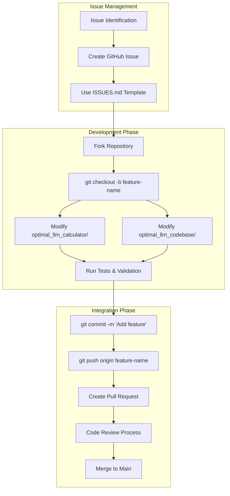
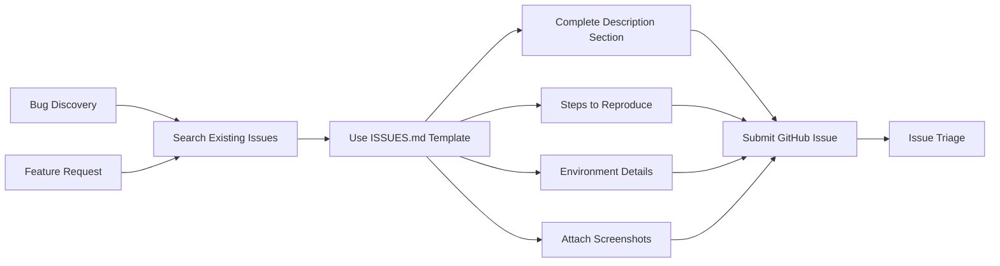
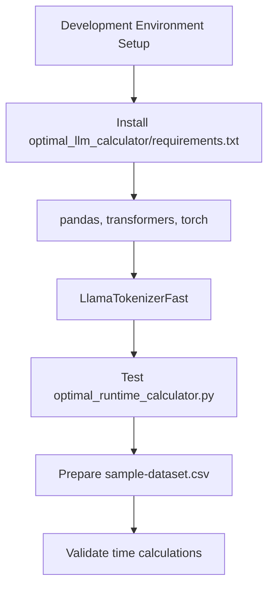
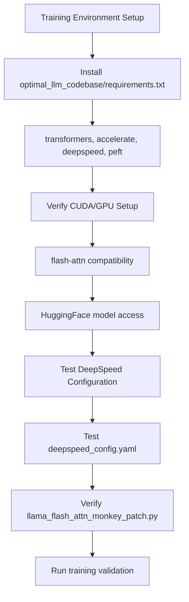

# Development Guide

Relevant source files

The following files were used as context for generating this wiki page:

- [CONTRIBUTING.md](CONTRIBUTING.md)
- [ISSUES.md](ISSUES.md)

This document provides comprehensive guidance for developers contributing to the LLM Calculator repository. It covers the complete development workflow from issue reporting through code contribution, testing, and review processes. The guide addresses both components of the system: the runtime calculator (`optimal_llm_calculator/`) and the training codebase (`optimal_llm_codebase/`).

For information about the runtime calculator functionality, see [LLM Runtime Calculator Package](#2). For details about the training pipeline implementation, see [LLM Training Codebase Package](#3).

## Development Workflow Overview

The development process follows a structured approach that ensures quality contributions while maintaining system stability across both calculator and training components.

### Development Process Flow

**Sources:** [CONTRIBUTING.md:17-25](), [ISSUES.md:1-61]()

## Issue Reporting and Management

### Issue Creation Process

All bugs, feature requests, and enhancements must be tracked through GitHub Issues using the structured template provided in `ISSUES.md`.

### Required Issue Components

| Section | Purpose | Calculator-Specific | Training-Specific |
|---------|---------|-------------------|------------------|
| Description | Clear problem statement | Runtime calculation errors | Training pipeline failures |
| Steps to Reproduce | Exact reproduction steps | Command parameters used | Model configuration details |
| Expected Behavior | What should happen | Correct time estimates | Successful training completion |
| Actual Behavior | What actually happened | Incorrect calculations | Training errors or crashes |
| Environment | System specifications | Python version, dataset size | GPU specs, CUDA version, library versions |
| Screenshots | Visual evidence | Calculator output | Training logs, error traces |

**Sources:** [ISSUES.md:5-61](), [CONTRIBUTING.md:10-16]()

## Code Contribution Process

### Repository Structure for Contributors

Contributors need to understand the dual-package structure when making changes:

```mermaid
graph TB
    REPO["llm_calculator Repository"]
    
    CALC_PKG["optimal_llm_calculator/"]
    TRAIN_PKG["optimal_llm_codebase/"]
    DOCS["Documentation Files"]
    
    CALC_SCRIPT["optimal_runtime_calculator.py"]
    CALC_DATA["sample-dataset.csv"]
    CALC_REQ["requirements.txt"]
    
    TRAIN_MAIN["train.py"]
    TRAIN_UTILS["utils.py"]
    TRAIN_CONFIG["deepspeed_config.yaml"]
    TRAIN_PATCH["llama_flash_attn_monkey_patch.py"]
    TRAIN_DATA["bitcoin-sentiment-dataset.csv"]
    TRAIN_REQ["requirements.txt"]
    
    CONTRIB["CONTRIBUTING.md"]
    ISSUES_TPL["ISSUES.md"]
    LICENSE_FILE["LICENSE"]
    MAINTAINERS_FILE["MAINTAINERS.md"]
    
    REPO --> CALC_PKG
    REPO --> TRAIN_PKG
    REPO --> DOCS
    
    CALC_PKG --> CALC_SCRIPT
    CALC_PKG --> CALC_DATA
    CALC_PKG --> CALC_REQ
    
    TRAIN_PKG --> TRAIN_MAIN
    TRAIN_PKG --> TRAIN_UTILS
    TRAIN_PKG --> TRAIN_CONFIG
    TRAIN_PKG --> TRAIN_PATCH
    TRAIN_PKG --> TRAIN_DATA
    TRAIN_PKG --> TRAIN_REQ
    
    DOCS --> CONTRIB
    DOCS --> ISSUES_TPL
    DOCS --> LICENSE_FILE
    DOCS --> MAINTAINERS_FILE
```

### Git Workflow Commands

The standard contribution workflow follows these Git operations:

| Step | Command | Purpose |
|------|---------|---------|
| Fork | GitHub UI action | Create personal repository copy |
| Clone | `git clone https://github.com/YOUR_USERNAME/llm_calculator.git` | Local repository setup |
| Branch | `git checkout -b feature-name` | Isolated development environment |
| Commit | `git commit -m 'Add feature'` | Save changes with descriptive message |
| Push | `git push origin feature-name` | Upload changes to personal fork |
| Pull Request | GitHub UI action | Request code integration |

**Sources:** [CONTRIBUTING.md:17-25]()

## Development Environment Setup

### Calculator Development Environment

For contributors working on the runtime calculator component:

### Training Development Environment

For contributors working on the training pipeline:

**Sources:** [optimal_llm_calculator/requirements.txt](), [optimal_llm_codebase/requirements.txt]()

## Code Standards and Testing

### Quality Assurance Requirements

Contributors must ensure their code meets the following standards before submission:

| Component | Testing Requirement | Validation Method |
|-----------|---------------------|------------------|
| `optimal_runtime_calculator.py` | Calculation accuracy | Compare with known benchmarks |
| `train.py` | Training completion | End-to-end test with small dataset |
| `utils.py` | Function correctness | Unit tests for `create_and_prepare_model`, `create_datasets` |
| `deepspeed_config.yaml` | Configuration validity | DeepSpeed config validation |
| `llama_flash_attn_monkey_patch.py` | Patch compatibility | Flash attention functionality test |

### Pre-Submission Checklist

Before creating a pull request, contributors must verify:

- [ ] Code adheres to existing coding standards
- [ ] All relevant tests pass
- [ ] Documentation is updated if applicable
- [ ] No breaking changes to existing functionality
- [ ] Dependencies are properly declared in `requirements.txt`
- [ ] Changes are compatible with both calculator and training components

**Sources:** [CONTRIBUTING.md:25]()

## Pull Request and Review Process

### Review Criteria

Pull requests are evaluated based on:

1. **Functional Correctness**: Changes work as intended
2. **Code Quality**: Follows project conventions and best practices
3. **Documentation**: Adequate documentation for new features
4. **Testing**: Appropriate test coverage
5. **Compatibility**: No conflicts with existing functionality
6. **Performance**: No significant performance regressions

### License Agreement

By contributing to the repository, contributors agree that their contributions will be licensed under the project's license terms as specified in the `LICENSE` file.

**Sources:** [CONTRIBUTING.md:27-29](), [CONTRIBUTING.md:33-34]()
