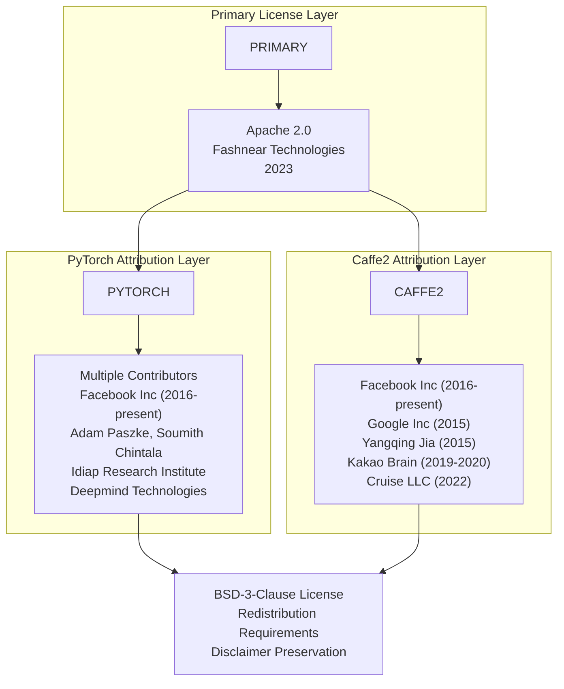
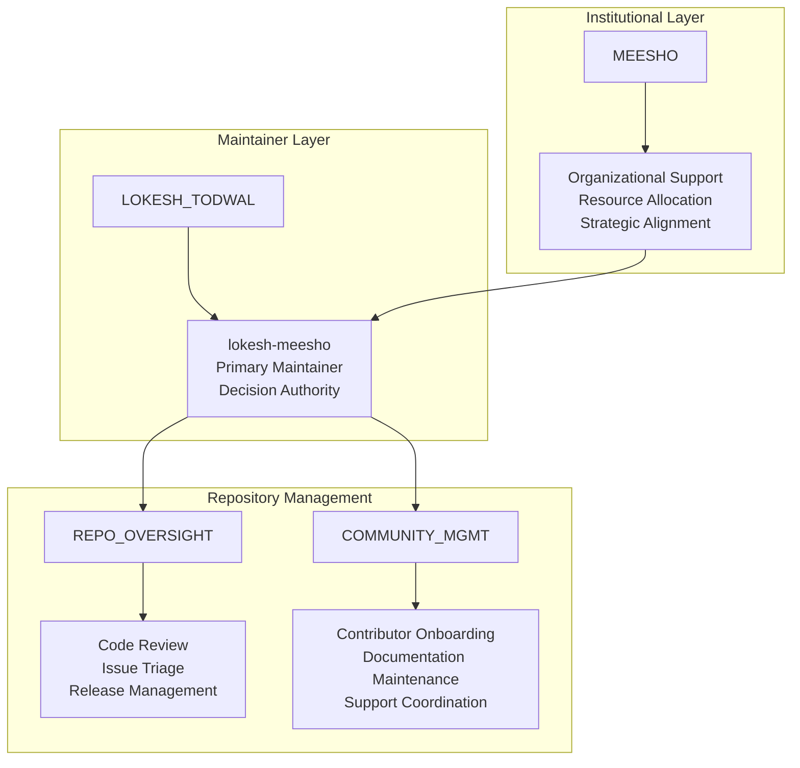
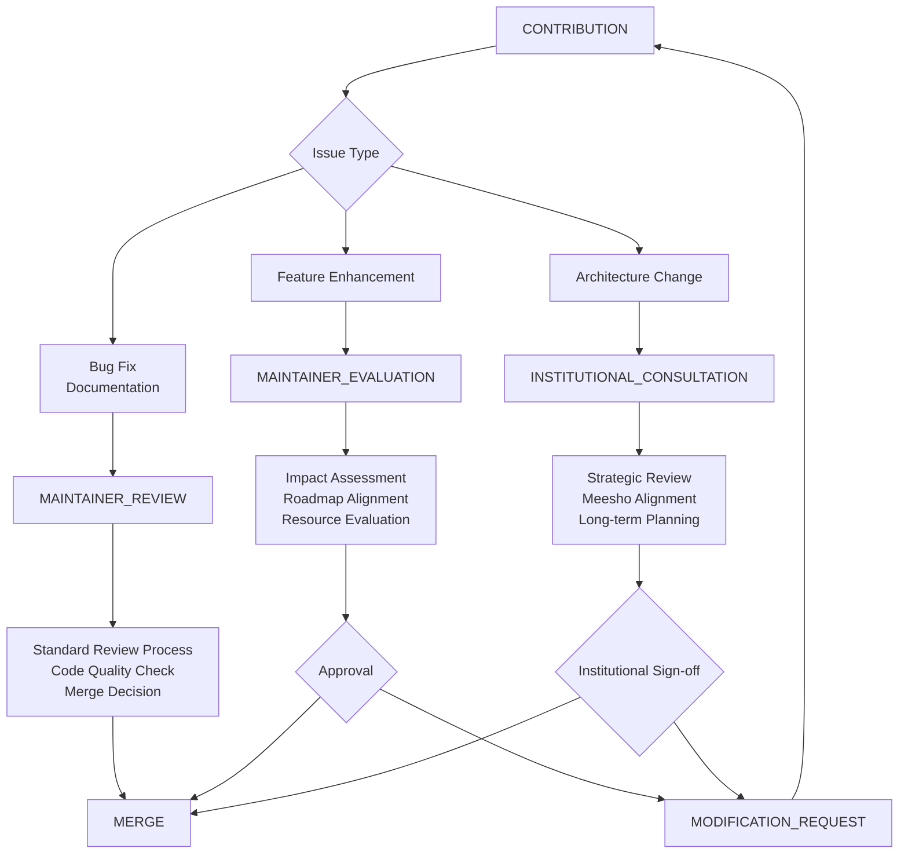

# Project Governance

Relevant source files

The following files were used as context for generating this wiki page:

- [LICENSE](LICENSE)
- [MAINTAINERS.md](MAINTAINERS.md)

This document outlines the governance structure, licensing terms, and maintainer responsibilities for the LLM Calculator repository. It defines the organizational framework for decision-making, contribution management, and legal compliance.

For information about the contribution process and development guidelines, see [Development Guide](#4).

## Licensing Structure

The project operates under a multi-layered licensing model that accommodates both original code and dependencies from major machine learning frameworks.

### Primary License

The LLM Calculator codebase is licensed under the Apache License 2.0, with copyright held by Fashnear Technologies Private Limited as of 2023. This license provides broad permissions for use, modification, and distribution while requiring attribution and disclaimer preservation.

**Primary License Components:**
- **License Type**: Apache License 2.0
- **Copyright Holder**: Fashnear Technologies Private Limited
- **Year**: 2023
- **Key Permissions**: Commercial use, modification, distribution, patent use
- **Key Requirements**: License inclusion, copyright notice, state changes

### Dependency Attribution

The project includes significant attribution to upstream dependencies, particularly PyTorch and Caffe2 frameworks that form the foundation of the machine learning capabilities.

**Governance Impact of License Structure**

Sources: [LICENSE:1-92]()

## Maintainer Structure

The project operates under a focused maintainer model with clearly defined responsibilities and institutional backing.

### Current Maintainer Team

| Role | Name | GitHub ID | Affiliation | Responsibilities |
|------|------|-----------|-------------|------------------|
| Primary Maintainer | Lokesh Todwal | `lokesh-meesho` | Meesho | Repository oversight, release management, strategic decisions |

### Maintainer Responsibilities

The maintainer structure follows a single-point-of-contact model that ensures accountability while maintaining institutional support through Meesho's backing.

**Maintainer Onboarding Process**

The project welcomes new maintainers through the contribution pathway outlined in the `CONTRIBUTING.md` document. Potential maintainers demonstrate expertise through sustained contributions and community engagement.

Sources: [MAINTAINERS.md:1-13]()

## Governance Model

The project follows a benevolent maintainer governance model with institutional backing, designed to support both open-source collaboration and enterprise-grade reliability.

### Decision-Making Framework

### Governance Principles

**Technical Excellence**: All contributions must meet high standards for code quality, documentation, and testing, particularly given the performance-critical nature of LLM optimization.

**Community Collaboration**: While maintaining institutional backing, the project encourages community contributions and transparent decision-making processes.

**Enterprise Reliability**: Decisions prioritize stability and reliability to support production deployments of LLM fine-tuning workflows.

**Open Source Commitment**: Despite corporate backing, the project maintains open-source principles and licensing compliance.

Sources: [MAINTAINERS.md:6-6]()

## Compliance and Legal Framework

### License Compliance Requirements

Contributors and users must adhere to the multi-layered licensing structure, ensuring proper attribution and compliance with both Apache 2.0 and BSD-3-Clause requirements from upstream dependencies.

**Required Compliance Actions:**
- Include original copyright notices in redistributions
- Maintain license file in distributions  
- Provide clear attribution to PyTorch and Caffe2 contributors
- Include disclaimer text in binary distributions
- Document any modifications to original source code

### Institutional Governance Alignment

As a Meesho-backed project, governance decisions consider enterprise requirements while maintaining open-source community principles. This dual commitment ensures both innovation and reliability for production LLM optimization workflows.

Sources: [LICENSE:1-14](), [LICENSE:66-91]()
