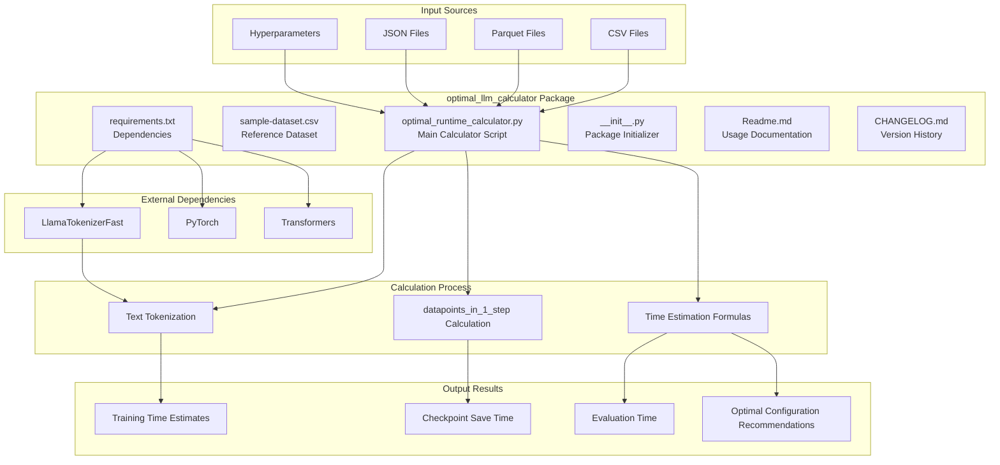
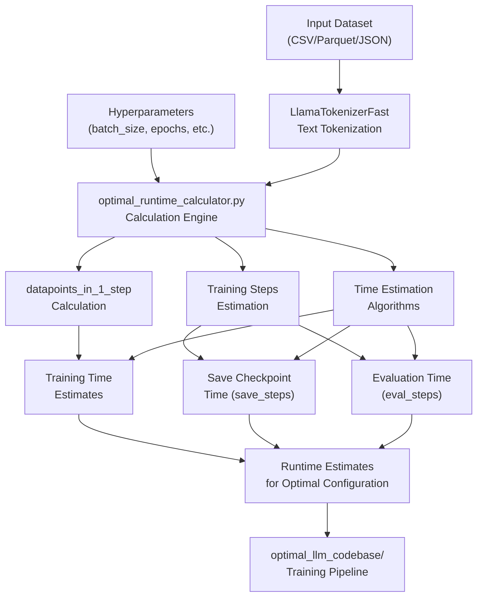
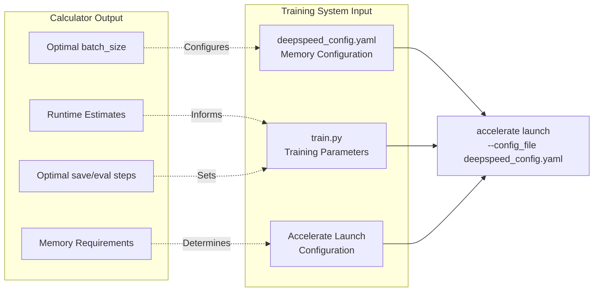

# LLM Runtime Calculator Package

Relevant source files

The following files were used as context for generating this wiki page:

- [optimal_llm_calculator/CHANGELOG.md](optimal_llm_calculator/CHANGELOG.md)
- [optimal_llm_calculator/Readme.md](optimal_llm_calculator/Readme.md)
- [optimal_llm_calculator/__init__.py](optimal_llm_calculator/__init__.py)

## Purpose and Scope

The LLM Runtime Calculator Package provides time estimation capabilities for fine-tuning Llama2-7b models. This package calculates optimal runtime parameters and training duration estimates based on dataset characteristics, hyperparameter configurations, and hardware specifications. The calculator serves as the first phase of the optimization pipeline, feeding its results to the training system covered in [LLM Training Codebase Package](#3).

For information about the actual fine-tuning execution and model training, see [LLM Training Codebase Package](#3).

## Package Architecture

The `optimal_llm_calculator/` directory implements a standalone calculation system with the following core components:

Sources: [optimal_llm_calculator/Readme.md:1-28](), [optimal_llm_calculator/CHANGELOG.md:1-10](), [optimal_llm_calculator/__init__.py:1]()

## Core Functionality

The package specializes in runtime estimation for Llama2-7b model variants through several key capabilities:

### Model Support Matrix

| Feature | Support Status | Notes |
|---------|----------------|--------|
| Llama2-7b Variants | Full Support | All NousResearch/Llama-2-7b-hf variants |
| Data Formats | CSV, Parquet, JSON | Configurable via `data_path` parameter |
| Hardware Optimization | A100 Recommended | Flash attention optimization for A100 GPUs |
| Batch Processing | Configurable | `batch_size` and `gradient_accumulation_step` parameters |

### Runtime Calculation Methodology

The calculator implements time estimation through the following computational flow:

Sources: [optimal_llm_calculator/Readme.md:14-27](), [optimal_llm_calculator/CHANGELOG.md:7-9]()

## Command Line Interface

The main script `optimal_runtime_calculator.py` exposes a comprehensive parameter interface for runtime estimation:

### Core Parameters

| Parameter | Purpose | Example Value |
|-----------|---------|---------------|
| `hf_model_name_or_path` | Hugging Face model identifier | `NousResearch/Llama-2-7b-hf` |
| `data_path` | Input dataset file path | `./sample-dataset.csv` |
| `data_field` | Text column name in dataset | `'text'` |
| `max_length` | Maximum sequence length | `1100` |
| `padding` | Enable padding | `True` |
| `truncation` | Enable truncation | `True` |

### Training Configuration Parameters

| Parameter | Purpose | Impact on Runtime |
|-----------|---------|------------------|
| `batch_size` | Batch size for training | Affects memory usage and training speed |
| `gradient_accumulation_step` | Gradient accumulation steps | Controls effective batch size |
| `num_of_epochs` | Number of training epochs | Direct multiplier on total time |
| `save_steps` | Checkpoint save frequency | Impacts storage I/O overhead |
| `eval_steps` | Evaluation frequency | Adds evaluation time overhead |

### Evaluation Configuration

| Parameter | Purpose | Default |
|-----------|---------|---------|
| `number_of_datapoints_to_keep_in_eval` | Evaluation dataset size | `5` |

Sources: [optimal_llm_calculator/Readme.md:14-27]()

## Integration with Training Pipeline

The calculator outputs feed directly into the training system configuration:

Sources: [optimal_llm_calculator/Readme.md:3-6](), [optimal_llm_calculator/CHANGELOG.md:4-5]()

## Hardware Optimization Features

The calculator incorporates hardware-specific optimizations, particularly for A100 GPU configurations:

### Flash Attention Integration

The system accounts for Flash Attention performance improvements available on A100 hardware, significantly reducing training time estimates when this optimization is available.

### Memory Efficiency Calculations

Time estimation formulas incorporate memory optimization techniques including:
- Gradient checkpointing overhead
- Mixed precision training benefits  
- ZeRO-stage memory partitioning effects

Sources: [optimal_llm_calculator/Readme.md:5-6]()
