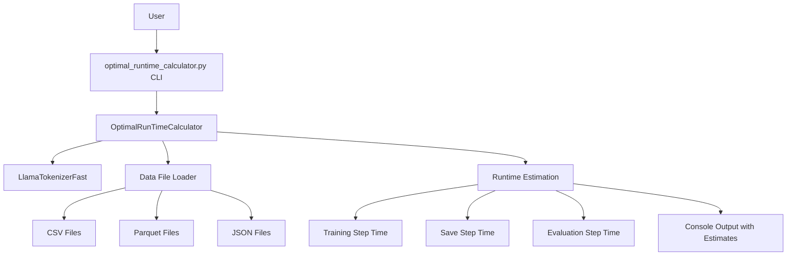
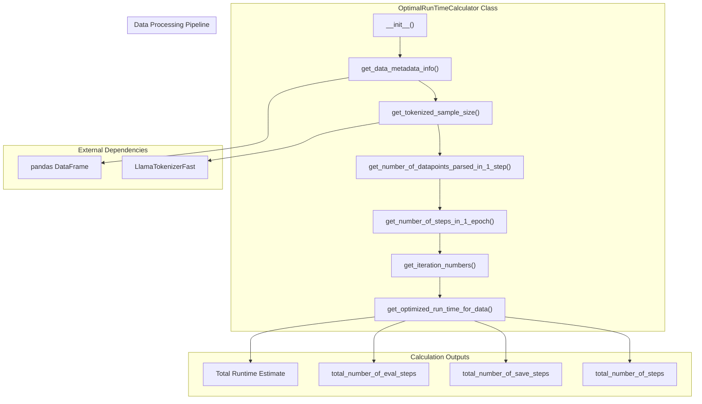
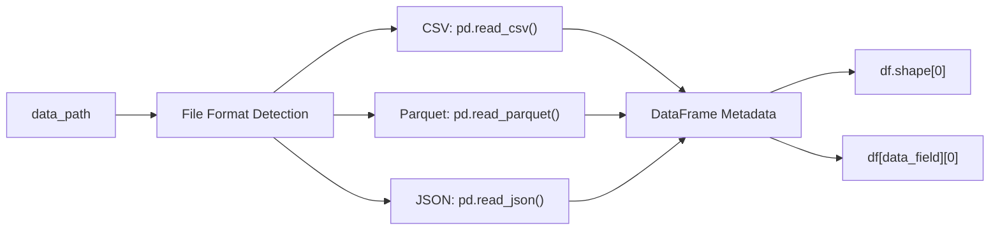
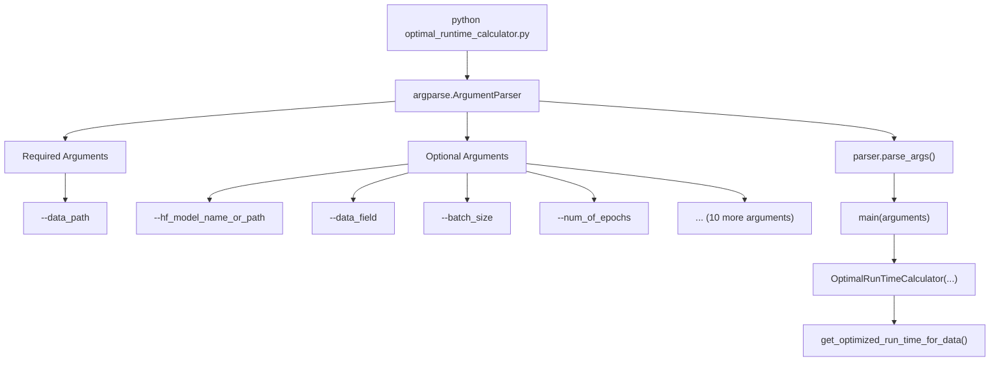

# Runtime Calculator Script

<details>
<summary>Relevant source files</summary>

The following files were used as context for generating this wiki page:

- [optimal_llm_calculator/optimal_runtime_calculator.py](optimal_llm_calculator/optimal_runtime_calculator.py)
- [optimal_llm_calculator/requirements.txt](optimal_llm_calculator/requirements.txt)

</details>


This page documents the core runtime calculation script located in the `optimal_llm_calculator` package. The script provides command-line functionality to estimate optimal runtime parameters for fine-tuning Llama2-7b models based on dataset characteristics and training configuration.

For information about the dataset format used by this calculator, see [Sample Dataset Format](#2.2). For details about the actual training implementation that uses these calculations, see [Training Pipeline](#3.1).

## Purpose and Scope

The `optimal_runtime_calculator.py` script serves as a preprocessing tool that analyzes datasets and training parameters to provide time estimates for LLM fine-tuning operations. It calculates the expected duration of training steps, evaluation steps, and checkpoint saving operations, enabling users to plan resource allocation and training schedules effectively.

**System Integration Overview**



**Sources:** [optimal_llm_calculator/optimal_runtime_calculator.py:1-285]()

## Core Calculator Class Architecture

The `OptimalRunTimeCalculator` class implements the main calculation logic through a systematic approach that processes input parameters, analyzes data characteristics, and computes runtime estimates.

**OptimalRunTimeCalculator Class Structure**



**Sources:** [optimal_llm_calculator/optimal_runtime_calculator.py:16-192]()

## Initialization and Configuration

The `OptimalRunTimeCalculator` constructor accepts 14 parameters that define the training configuration and data processing settings.

### Constructor Parameters

| Parameter | Type | Purpose |
|-----------|------|---------|
| `hf_model_name_or_path` | str | Hugging Face model identifier |
| `data_path` | str | Path to training dataset |
| `data_field` | str | Column name containing text data |
| `number_of_datapoints_to_keep_in_eval` | int | Evaluation dataset size |
| `number_of_datapoints_to_keep_in_training` | Optional[int] | Training dataset size limit |
| `batch_size` | int | Training batch size |
| `gradient_accumulation_step` | int | Gradient accumulation steps |
| `num_of_epochs` | int | Training epochs |
| `save_steps` | int | Checkpoint save frequency |
| `eval_steps` | int | Evaluation frequency |
| `max_length` | int | Maximum token length |
| `padding` | bool | Token padding flag |
| `truncation` | bool | Token truncation flag |

The initialization process automatically computes derived values including `tokenized_size`, `datapoints_in_1_step`, and `number_of_step_in_1_epoch`.

**Sources:** [optimal_llm_calculator/optimal_runtime_calculator.py:21-67]()

## Data Processing and Tokenization

### File Format Support

The calculator supports three data formats through the `get_data_metadata_info()` method:



**Sources:** [optimal_llm_calculator/optimal_runtime_calculator.py:68-84]()

### Tokenization Process

The `get_tokenized_sample_size()` method uses `LlamaTokenizerFast` to determine token counts:

1. Loads tokenizer from the specified Hugging Face model path
2. Sets `pad_token` to `eos_token` for consistency
3. Tokenizes sample data with specified padding, truncation, and max_length settings
4. Returns length of `input_ids` array

**Sources:** [optimal_llm_calculator/optimal_runtime_calculator.py:86-103]()

## Runtime Calculation Methodology

### Step Calculations

The calculator computes training steps through a specific formula in `get_number_of_datapoints_parsed_in_1_step()`:

```
datapoints_in_1_step = batch_size × gradient_accumulation_step × 8
```

The hardcoded multiplier of 8 appears to account for distributed training setup assumptions.

**Sources:** [optimal_llm_calculator/optimal_runtime_calculator.py:105-109]()

### Time Estimation Formulas

The `get_optimized_run_time_for_data()` method applies empirical formulas to estimate runtime:

#### Training Step Time
```
training_time = total_steps × 93 × (tokenized_size/550) × (datapoints_per_step/4096)
```

#### Save Step Time
```
save_time = total_save_steps × 23
```

#### Evaluation Step Time
```
eval_time = total_eval_steps × 44 × (tokenized_size/550) × (eval_datapoints/6868)
```

These formulas use baseline values (93, 23, 44 seconds) and scaling factors based on token size and data volume.

**Sources:** [optimal_llm_calculator/optimal_runtime_calculator.py:142-191]()

## Command-Line Interface

The script provides a comprehensive command-line interface through `argparse`:

**CLI Argument Flow**



**Sources:** [optimal_llm_calculator/optimal_runtime_calculator.py:214-284]()

### Default Values

Key default parameters include:
- `hf_model_name_or_path`: `"NousResearch/Llama-2-7b-hf"`
- `data_field`: `"text"`
- `batch_size`: `8`
- `gradient_accumulation_step`: `64`
- `max_length`: `1100`
- `number_of_datapoints_to_keep_in_eval`: `6868`

**Sources:** [optimal_llm_calculator/optimal_runtime_calculator.py:216-280]()

## Usage Patterns

### Basic Usage
```bash
python optimal_runtime_calculator.py --data_path sample-dataset.csv
```

### Advanced Configuration
```bash
python optimal_runtime_calculator.py \
    --data_path custom-data.parquet \
    --data_field content \
    --batch_size 16 \
    --num_of_epochs 3 \
    --max_length 2048
```

### Output Format

The calculator prints structured output including:
- Total training steps count
- Time breakdown by operation type (training, saving, evaluation)
- Total runtime estimate in seconds and minutes/seconds format

**Sources:** [optimal_llm_calculator/optimal_runtime_calculator.py:169-191](), [optimal_llm_calculator/optimal_runtime_calculator.py:194-211]()

## Dependencies

The calculator requires minimal dependencies specified in the requirements file:

- `transformers==4.34.0` - For `LlamaTokenizerFast` functionality

**Sources:** [optimal_llm_calculator/requirements.txt:1]()
