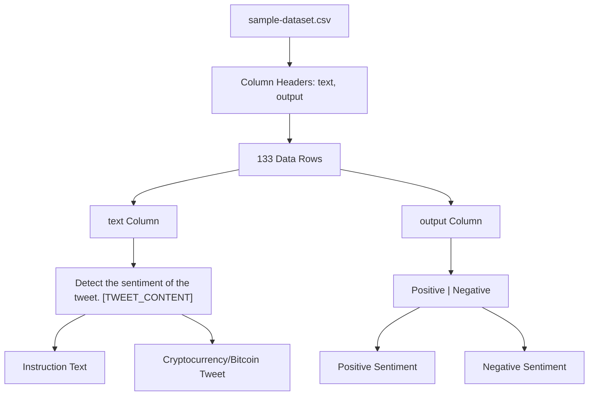
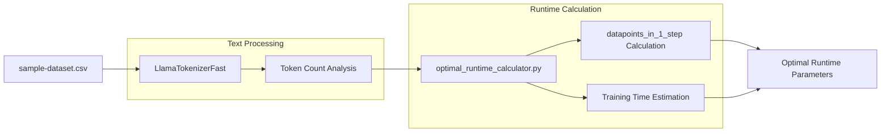
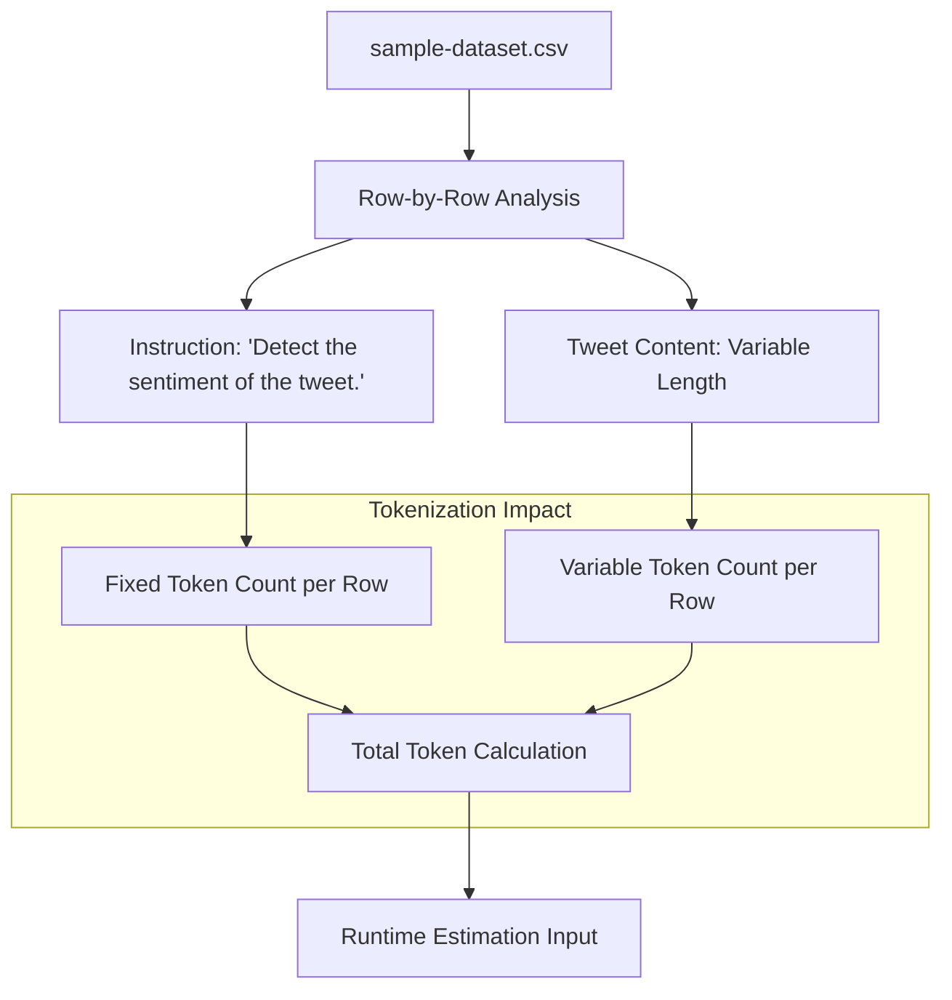

# Sample Dataset Format

<details>
<summary>Relevant source files</summary>

The following files were used as context for generating this wiki page:

- [optimal_llm_calculator/sample-dataset.csv](optimal_llm_calculator/sample-dataset.csv)

</details>


## Purpose and Scope

This document describes the structure and format of the sample dataset used by the LLM Runtime Calculator to estimate optimal training parameters. The sample dataset serves as a representative example for calculating tokenization metrics, data processing times, and memory requirements during fine-tuning operations.

For information about the runtime calculator implementation, see [Runtime Calculator Script](#2.1). For details about the training dataset used in actual model fine-tuning, see [Training Dataset](#3.5).

## Dataset Structure Overview

The sample dataset is provided as a CSV file located at [optimal_llm_calculator/sample-dataset.csv:1-134]() and follows a standardized two-column format designed for sentiment classification tasks.

### CSV Schema

| Column Name | Data Type | Description |
|-------------|-----------|-------------|
| `text` | String | Input prompt containing the instruction and tweet text |
| `output` | String | Target sentiment classification label |

### Data Format Specification



**Sources:** [optimal_llm_calculator/sample-dataset.csv:1-134]()

## Column Specifications

### Text Column Format

Each entry in the `text` column follows a consistent prompt template:

```
"Detect the sentiment of the tweet. [TWEET_CONTENT]"
```

The prompt structure consists of:
- **Instruction prefix**: `"Detect the sentiment of the tweet. "`
- **Tweet content**: Variable-length cryptocurrency-related social media text
- **Content characteristics**: Contains mentions of Bitcoin, blockchain, trading, and related financial topics

Example entries from the dataset:
- `"Detect the sentiment of the tweet. RT @tippereconomy: Another use case for #blockchain and #Tipper..."`
- `"Detect the sentiment of the tweet. Bitcoin heading back down. … $BTCUSD"`

### Output Column Format

The `output` column contains binary sentiment classifications:
- **Positive**: Indicates favorable or optimistic sentiment
- **Negative**: Indicates unfavorable or pessimistic sentiment

## Dataset Processing Workflow



**Sources:** [optimal_llm_calculator/sample-dataset.csv:1-134]()

## Data Characteristics

### Content Distribution

The dataset exhibits the following characteristics:

| Metric | Value | Description |
|--------|--------|-------------|
| Total Rows | 133 | Complete dataset size |
| Text Format | Instruction + Tweet | Consistent prompt template |
| Domain | Cryptocurrency/Bitcoin | Specialized content domain |
| Task Type | Binary Classification | Sentiment analysis task |

### Prompt Structure Analysis



**Sources:** [optimal_llm_calculator/sample-dataset.csv:1-134]()

### Label Distribution

Based on the dataset content:
- **Positive samples**: Majority of entries (approximately 85%)
- **Negative samples**: Minority of entries (approximately 15%)
- **Class imbalance**: Present, reflecting real-world social media sentiment patterns

## Usage in Runtime Calculations

The sample dataset serves as input to the runtime calculator through the following process:

1. **Tokenization**: Each `text` entry is processed by `LlamaTokenizerFast` to determine token counts
2. **Batch calculation**: Token counts inform the `datapoints_in_1_step` calculation
3. **Time estimation**: Dataset size and complexity influence training time projections
4. **Memory estimation**: Text length variations help estimate memory requirements

The dataset's cryptocurrency focus and instruction-following format make it representative of typical fine-tuning scenarios for sentiment analysis tasks on social media content.

**Sources:** [optimal_llm_calculator/sample-dataset.csv:1-134]()
