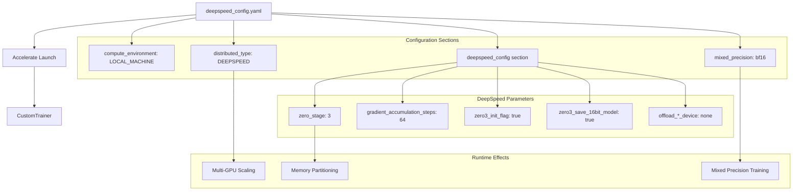
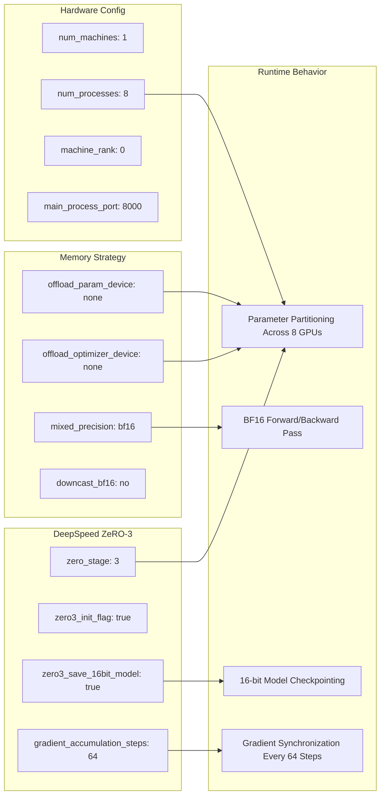
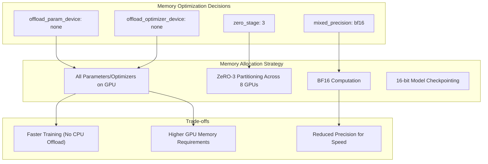

# DeepSpeed Configuration

<details>
<summary>Relevant source files</summary>

The following files were used as context for generating this wiki page:

- [optimal_llm_codebase/deepspeed_config.yaml](optimal_llm_codebase/deepspeed_config.yaml)

</details>


This document covers the DeepSpeed distributed training configuration used by the LLM fine-tuning pipeline. The configuration enables memory-efficient training of large language models through ZeRO (Zero Redundancy Optimizer) Stage 3 partitioning and mixed-precision training. For information about the core training pipeline that uses this configuration, see [Training Pipeline](#3.1).

## Overview

The DeepSpeed configuration is defined in a single YAML file that specifies distributed training parameters, memory optimization settings, and hardware utilization strategies. This configuration integrates with the Hugging Face Accelerate library to provide seamless distributed training capabilities for Llama2-7b fine-tuning.

## Configuration Architecture

The DeepSpeed setup follows a hierarchical configuration structure that defines compute environment, distributed training parameters, and memory optimization strategies.

### DeepSpeed Integration Flow



Sources: [optimal_llm_codebase/deepspeed_config.yaml:1-24]()

### Configuration Parameter Mapping



Sources: [optimal_llm_codebase/deepspeed_config.yaml:3-24]()

## Configuration Parameters

### Compute Environment Settings

The configuration targets a `LOCAL_MACHINE` environment with specific hardware assumptions:

| Parameter | Value | Purpose |
|-----------|-------|---------|
| `compute_environment` | `LOCAL_MACHINE` | Single-node distributed training |
| `num_machines` | `1` | Single machine setup |
| `num_processes` | `8` | Number of GPU processes/cores |
| `machine_rank` | `0` | Primary machine identifier |

The `num_processes: 8` setting assumes an 8-GPU system, as indicated by the inline comment [optimal_llm_codebase/deepspeed_config.yaml:18]().

Sources: [optimal_llm_codebase/deepspeed_config.yaml:1-2](), [optimal_llm_codebase/deepspeed_config.yaml:17-18]()

### DeepSpeed ZeRO Configuration

The core DeepSpeed parameters enable ZeRO Stage 3 optimization:

| Parameter | Value | Impact |
|-----------|-------|--------|
| `zero_stage` | `3` | Full parameter + optimizer + gradient partitioning |
| `zero3_init_flag` | `true` | Initialize model parameters in partitioned state |
| `zero3_save_16bit_model` | `true` | Save checkpoints in 16-bit precision |
| `gradient_accumulation_steps` | `64` | Accumulate gradients across 64 micro-batches |

The `zero_stage: 3` configuration provides maximum memory efficiency by partitioning model parameters, optimizer states, and gradients across all available GPUs [optimal_llm_codebase/deepspeed_config.yaml:10]().

Sources: [optimal_llm_codebase/deepspeed_config.yaml:5](), [optimal_llm_codebase/deepspeed_config.yaml:8-10]()

### Memory Optimization Strategy

The configuration implements an aggressive memory optimization approach:



The strategy prioritizes training speed over memory conservation by keeping all parameters and optimizer states on GPUs rather than offloading to CPU [optimal_llm_codebase/deepspeed_config.yaml:6-7]().

Sources: [optimal_llm_codebase/deepspeed_config.yaml:6-7](), [optimal_llm_codebase/deepspeed_config.yaml:16]()

### Distributed Training Setup

The configuration establishes a standard distributed training environment:

| Parameter | Value | Function |
|-----------|-------|----------|
| `distributed_type` | `DEEPSPEED` | Enable DeepSpeed backend |
| `deepspeed_multinode_launcher` | `standard` | Use standard launcher for single-node |
| `main_process_port` | `8000` | Communication port for process coordination |
| `rdzv_backend` | `static` | Static rendezvous for process discovery |
| `same_network` | `true` | All processes on same network |

Sources: [optimal_llm_codebase/deepspeed_config.yaml:4](), [optimal_llm_codebase/deepspeed_config.yaml:11](), [optimal_llm_codebase/deepspeed_config.yaml:15](), [optimal_llm_codebase/deepspeed_config.yaml:19-20]()

### Mixed Precision Configuration

The mixed precision setup balances performance and numerical stability:

- `mixed_precision: bf16` - Uses Brain Floating Point 16 for forward/backward passes
- `downcast_bf16: 'no'` - Prevents automatic downcasting that could affect model quality

BF16 provides better numerical range compared to FP16, making it more suitable for transformer model training [optimal_llm_codebase/deepspeed_config.yaml:16](), [optimal_llm_codebase/deepspeed_config.yaml:12]().

Sources: [optimal_llm_codebase/deepspeed_config.yaml:12](), [optimal_llm_codebase/deepspeed_config.yaml:16]()

## Integration with Training Pipeline

The configuration integrates with the training system through the Accelerate launcher command structure:

```bash
accelerate launch --config_file deepspeed_config.yaml train.py
```

This command utilizes the configuration parameters to initialize the distributed training environment before executing the main training script referenced in [Training Pipeline](#3.1).

Sources: [optimal_llm_codebase/deepspeed_config.yaml:1-24]()
