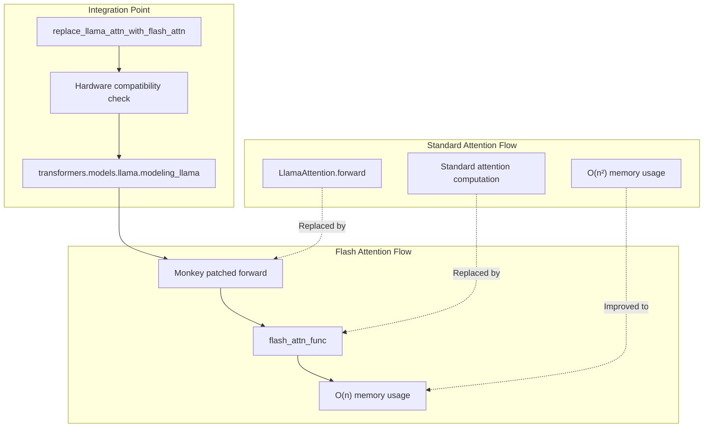
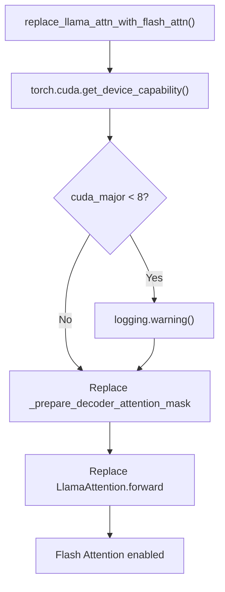
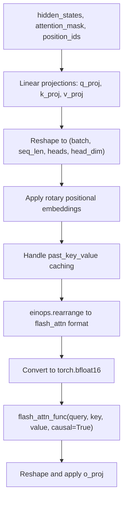
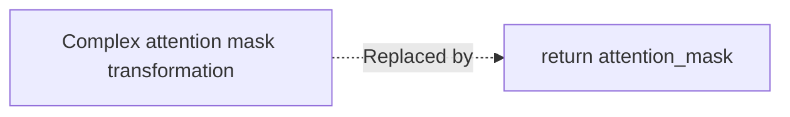
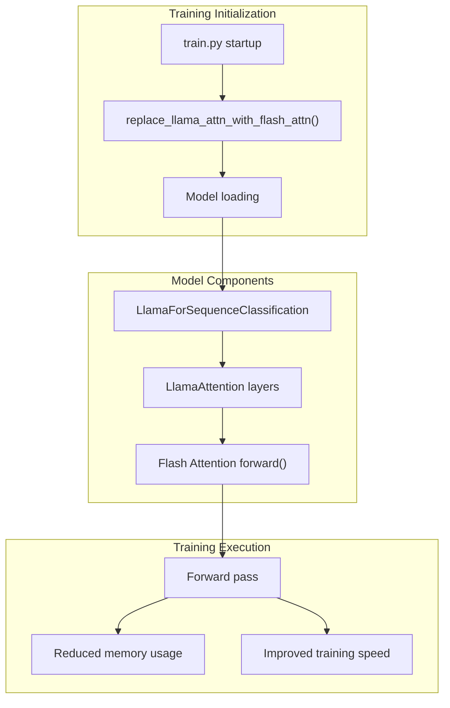

# Flash Attention Optimization

Relevant source files

The following files were used as context for generating this wiki page:

- [optimal_llm_codebase/llama_flash_attn_monkey_patch.py](optimal_llm_codebase/llama_flash_attn_monkey_patch.py)

## Purpose and Scope

This document covers the Flash Attention optimization implementation for Llama models within the training pipeline. The optimization replaces the standard attention mechanism with Flash Attention for improved memory efficiency and training speed on compatible hardware. For information about the broader training pipeline configuration, see [Training Pipeline](#3.1). For DeepSpeed integration details, see [DeepSpeed Configuration](#3.2).

## Overview

Flash Attention is implemented through a monkey patch that replaces the standard attention computation in Hugging Face's Llama model implementation. The optimization provides memory-efficient attention computation by reducing memory usage from quadratic to linear with respect to sequence length, while maintaining mathematical equivalence to standard attention.

Sources: [optimal_llm_codebase/llama_flash_attn_monkey_patch.py:1-94]()

## Monkey Patching Mechanism

The Flash Attention optimization works by dynamically replacing methods in the Hugging Face transformers library at runtime. The main entry point is the `replace_llama_attn_with_flash_attn` function.

### Hardware Compatibility Check

Before applying the patch, the system checks CUDA compute capability to ensure Flash Attention compatibility:

The function performs hardware validation at [optimal_llm_codebase/llama_flash_attn_monkey_patch.py:84-89]() and applies the patches at [optimal_llm_codebase/llama_flash_attn_monkey_patch.py:90-93]().

Sources: [optimal_llm_codebase/llama_flash_attn_monkey_patch.py:83-94]()

### Runtime Method Replacement

The monkey patch replaces two key methods in the transformers library:

| Original Method | Replacement Function | Purpose |
|-----------------|---------------------|---------|
| `LlamaModel._prepare_decoder_attention_mask` | `_prepare_decoder_attention_mask` | Simplifies attention mask preparation |
| `LlamaAttention.forward` | `forward` | Implements Flash Attention computation |

Sources: [optimal_llm_codebase/llama_flash_attn_monkey_patch.py:90-93]()

## Flash Attention Forward Pass

The core optimization is implemented in the custom `forward` method that replaces the standard attention computation:

Sources: [optimal_llm_codebase/llama_flash_attn_monkey_patch.py:16-73]()

### Key Implementation Details

The forward method includes several critical optimizations:

- **Tensor Reshaping**: Query, key, and value tensors are reshaped from `(batch, heads, seq_len, head_dim)` to `(batch, seq_len, heads, head_dim)` format required by Flash Attention at [optimal_llm_codebase/llama_flash_attn_monkey_patch.py:52-54]()

- **Data Type Conversion**: All tensors are converted to `torch.bfloat16` for optimal performance at [optimal_llm_codebase/llama_flash_attn_monkey_patch.py:56]()

- **Causal Attention**: Flash Attention is configured with `causal=True` for autoregressive language modeling at [optimal_llm_codebase/llama_flash_attn_monkey_patch.py:59]()

- **Output Validation**: The implementation includes shape validation to ensure correctness at [optimal_llm_codebase/llama_flash_attn_monkey_patch.py:61-65]()

Sources: [optimal_llm_codebase/llama_flash_attn_monkey_patch.py:52-67]()

## Attention Mask Simplification

The patch includes a simplified attention mask preparation function that bypasses the complex mask transformations in the original Llama implementation:

This simplification works because Flash Attention handles attention masking internally and expects the mask in the same format as the key padding mask.

Sources: [optimal_llm_codebase/llama_flash_attn_monkey_patch.py:78-80]()

## Integration with Training Pipeline

The Flash Attention optimization integrates seamlessly with the broader training system:

The optimization is applied early in the training pipeline, before model initialization, ensuring all attention computations benefit from the Flash Attention implementation.

Sources: [optimal_llm_codebase/llama_flash_attn_monkey_patch.py:83-94]()

## Hardware Requirements and Performance

Flash Attention requires specific hardware capabilities for optimal performance:

| Requirement | Specification | Notes |
|-------------|---------------|-------|
| GPU Architecture | CUDA Compute Capability ≥ 8.0 | A100, H100, or newer |
| Memory Type | HBM recommended | For maximum bandwidth |
| CUDA Version | Compatible with flash-attn library | Version-dependent |

The implementation includes a warning for older hardware at [optimal_llm_codebase/llama_flash_attn_monkey_patch.py:86-89]() but does not prevent execution, allowing for degraded performance on incompatible hardware.

### Performance Benefits

- **Memory Efficiency**: Reduces memory complexity from O(n²) to O(n) with respect to sequence length
- **Speed Improvement**: Faster attention computation through optimized CUDA kernels
- **Backward Compatibility**: Maintains mathematical equivalence with standard attention

Sources: [optimal_llm_codebase/llama_flash_attn_monkey_patch.py:84-89]()
