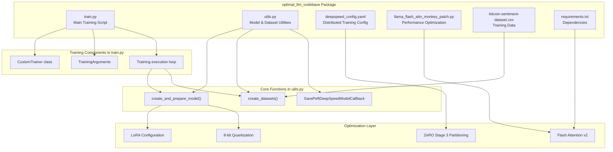
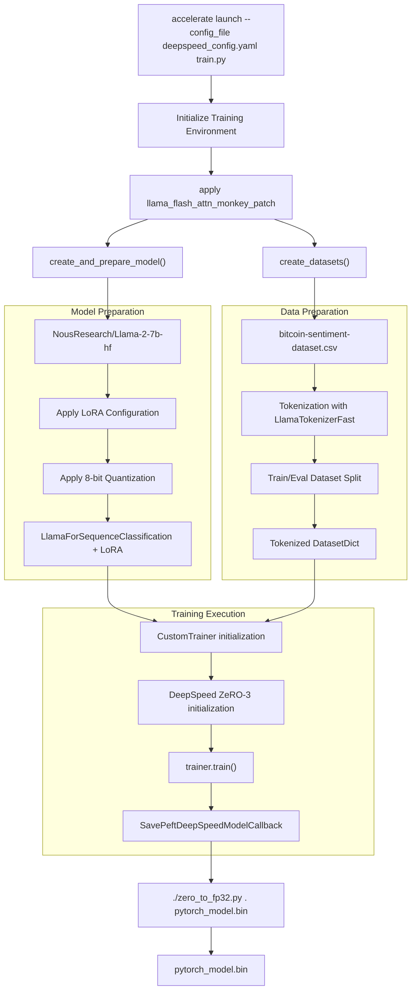

# LLM Training Codebase Package

<details>
<summary>Relevant source files</summary>

The following files were used as context for generating this wiki page:

- [optimal_llm_codebase/Readme.md](optimal_llm_codebase/Readme.md)
- [optimal_llm_codebase/__init__.py](optimal_llm_codebase/__init__.py)

</details>


## Purpose and Scope

The LLM Training Codebase Package implements the production fine-tuning pipeline for Llama2-7b models with performance optimizations. This package contains the actual training implementation that utilizes the optimal parameters calculated by the LLM Runtime Calculator Package (see [LLM Runtime Calculator Package](#2)). The codebase focuses on efficient fine-tuning through distributed training, memory optimization techniques, and hardware-specific acceleration.

The package provides a complete pipeline from model preparation through training execution to deployment-ready model conversion, specifically optimized for sentiment classification tasks using parameter-efficient fine-tuning methods.

## Package Architecture

### Training Pipeline Architecture



Sources: [optimal_llm_codebase/Readme.md:1-26]()

### Training Execution Flow



Sources: [optimal_llm_codebase/Readme.md:13-17](), [optimal_llm_codebase/Readme.md:19-25]()

## Core Components

### Training Script Integration

The package integrates multiple optimization frameworks through a unified interface:

| Component | Purpose | Integration Point |
|-----------|---------|------------------|
| `train.py` | Main training orchestration | Entry point for `accelerate launch` |
| `utils.py` | Model and dataset preparation | Called by `train.py` for setup |
| `deepspeed_config.yaml` | Distributed training configuration | Loaded by Accelerate framework |
| `llama_flash_attn_monkey_patch.py` | Hardware acceleration | Applied before model loading |

### Model Architecture Components

The training pipeline implements parameter-efficient fine-tuning through several integrated components:

```mermaid
graph LR
    subgraph "Base Model Loading"
        HUGGINGFACE_HUB["AutoModelForSequenceClassification.from_pretrained()"]
        LLAMA_BASE["NousResearch/Llama-2-7b-hf"]
    end
    
    subgraph "Parameter-Efficient Fine-Tuning"
        LORA_CONFIG["LoRAConfig"]
        PEFT_MODEL["get_peft_model()"]
        TASK_TYPE["TaskType.SEQ_CLS"]
    end
    
    subgraph "Memory Optimization"
        QUANTIZATION["BitsAndBytesConfig"]
        INT8["load_in_8bit=True"]
        GRADIENT_CHECKPOINTING["gradient_checkpointing=True"]
    end
    
    subgraph "Attention Optimization"
        FLASH_REPLACEMENT["replace_llama_attn_with_flash_attn()"]
        MEMORY_EFFICIENT["memory_efficient=True"]
        FLASH_ATTN_V2["flash-attn==2.3.0"]
    end
    
    HUGGINGFACE_HUB --> LLAMA_BASE
    LLAMA_BASE --> QUANTIZATION
    QUANTIZATION --> INT8
    INT8 --> GRADIENT_CHECKPOINTING
    
    GRADIENT_CHECKPOINTING --> FLASH_REPLACEMENT
    FLASH_REPLACEMENT --> MEMORY_EFFICIENT
    MEMORY_EFFICIENT --> FLASH_ATTN_V2
    
    FLASH_ATTN_V2 --> LORA_CONFIG
    LORA_CONFIG --> PEFT_MODEL
    PEFT_MODEL --> TASK_TYPE
```



Sources: [optimal_llm_codebase/Readme.md:1-26]()

## Usage Patterns

### Standard Training Execution

The package follows a standardized execution pattern using Accelerate with DeepSpeed:

```bash
accelerate launch --config_file deepspeed_config.yaml train.py
```

This command initiates the complete training pipeline with distributed processing capabilities enabled through the DeepSpeed configuration.

### Model Conversion Workflow  

After training completion, the package provides a conversion utility for deployment preparation:

1. Navigate to checkpoint directory: `cd /path/to/checkpoint_dir`
2. Execute conversion script: `./zero_to_fp32.py . pytorch_model.bin`

The conversion process transforms the DeepSpeed checkpoint format into a standard PyTorch model format suitable for inference deployment.

### Dependencies Management

The package maintains extensive dependencies for production-grade training:

| Category | Key Dependencies |
|----------|------------------|
| Core Framework | `transformers`, `torch`, `accelerate` |
| Distributed Training | `deepspeed` |
| Parameter-Efficient Training | `peft` |
| Memory Optimization | `bitsandbytes` |
| Performance | `flash-attn` |

Sources: [optimal_llm_codebase/Readme.md:6-8](), [optimal_llm_codebase/Readme.md:13-17](), [optimal_llm_codebase/Readme.md:19-25]()
