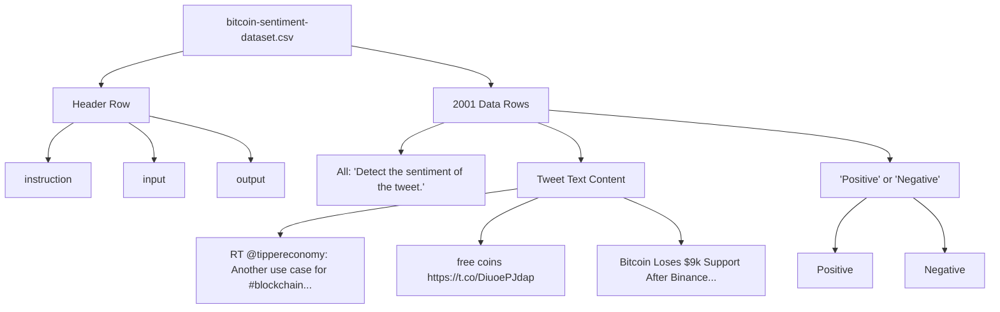
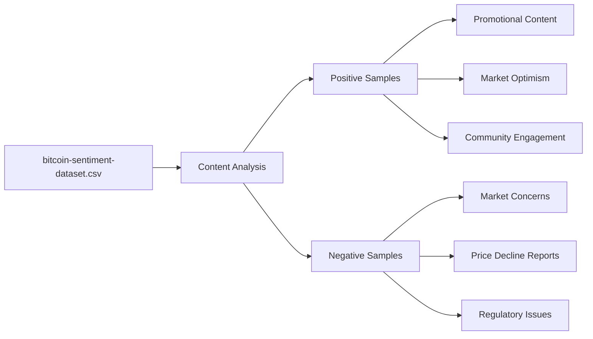
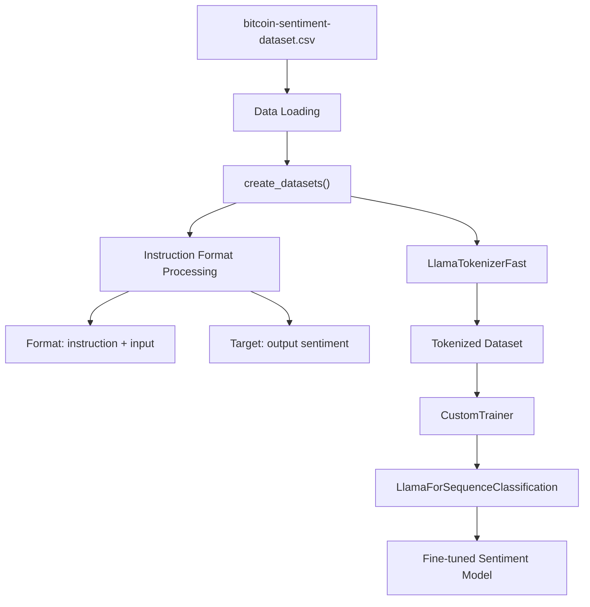
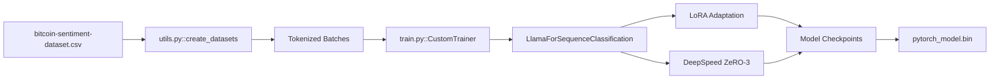

# Training Dataset

Relevant source files

The following files were used as context for generating this wiki page:

- [optimal_llm_codebase/bitcoin-sentiment-dataset.csv](optimal_llm_codebase/bitcoin-sentiment-dataset.csv)

This document describes the Bitcoin sentiment analysis dataset used for fine-tuning language models in the LLM training pipeline. The dataset serves as the primary training data for sentiment classification tasks focused on cryptocurrency-related social media content.

For information about the runtime estimation system that calculates optimal parameters for training with this dataset, see [Runtime Calculator Script](#2.1). For details about the training pipeline that processes this dataset, see [Training Pipeline](#3.1).

## Purpose and Structure

The training dataset is a CSV file containing Bitcoin and cryptocurrency-related tweets with sentiment labels, designed specifically for fine-tuning Llama2-7b models on sentiment classification tasks. The dataset follows a structured instruction-tuning format that enables the model to learn sentiment analysis through supervised learning.

**Dataset Structure**

Sources: [optimal_llm_codebase/bitcoin-sentiment-dataset.csv:1-2002]()

## Dataset Format and Schema

The dataset implements a consistent three-column format optimized for instruction-following model training:

| Column | Description | Example Values |
|--------|-------------|----------------|
| `instruction` | Task description (constant) | "Detect the sentiment of the tweet." |
| `input` | Tweet content | "RT @tippereconomy: Another use case for #blockchain..." |
| `output` | Sentiment label | "Positive", "Negative" |

**Key Characteristics:**
- **Total Records**: 2,001 labeled examples
- **Task Type**: Binary sentiment classification
- **Domain**: Bitcoin/cryptocurrency social media content
- **Format**: UTF-8 CSV with header row
- **Instruction Consistency**: All records use identical task instruction

Sources: [optimal_llm_codebase/bitcoin-sentiment-dataset.csv:1-10]()

## Content Analysis

The dataset contains diverse cryptocurrency-related content spanning various topics and sentiment expressions:

**Positive Sentiment Examples:**
- Promotional content: "RT @payvxofficial: WE are happy to announce that PayVX Presale Phase 1 is now LIVE!"
- Market optimism: "Bitcoin Is Now Preparing For A Major Move"
- Community engagement: "Copy successful traders automatically with Bitcoin!"

**Negative Sentiment Examples:**
- Market concerns: "Bitcoin Loses $9k Support After Binance Confusion"
- Price decline reports: "Bitcoin heading back down"
- Regulatory issues: "Should we be crying out for standardisation and regulation"

Sources: [optimal_llm_codebase/bitcoin-sentiment-dataset.csv:2-50](), [optimal_llm_codebase/bitcoin-sentiment-dataset.csv:48-65]()

## Integration with Training Pipeline

The dataset integrates with the training system through the `create_datasets` function in the utilities module, which processes the CSV data into tokenized format suitable for model training.

Sources: [optimal_llm_codebase/utils.py](), [optimal_llm_codebase/train.py]()

## Dataset Usage in Model Fine-tuning

The dataset is processed through several stages in the training pipeline:

1. **Data Loading**: CSV file loaded and parsed by training utilities
2. **Tokenization**: Text converted to tokens using `LlamaTokenizerFast`
3. **Format Processing**: Instruction-input pairs formatted for sequence classification
4. **Training**: Used with `CustomTrainer` for supervised fine-tuning
5. **Evaluation**: Split into training/validation sets for model assessment

**Training Integration Points:**
- Loaded by `create_datasets` utility function
- Tokenized using Llama tokenizer with specific formatting
- Fed to `CustomTrainer` with weighted loss function for class balancing
- Used in conjunction with DeepSpeed ZeRO-3 for distributed training

Sources: [optimal_llm_codebase/train.py](), [optimal_llm_codebase/utils.py](), [optimal_llm_codebase/deepspeed_config.yaml]()
