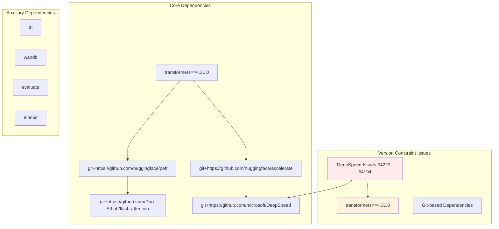
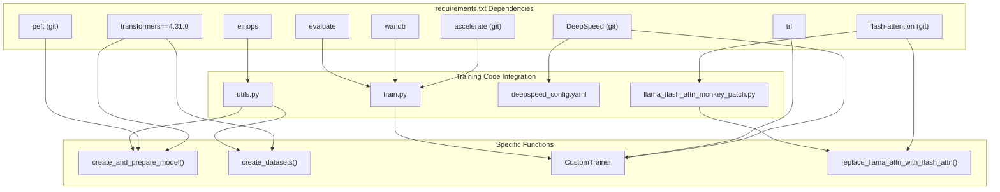

# Training Dependencies

<details>
<summary>Relevant source files</summary>

The following files were used as context for generating this wiki page:

- [optimal_llm_codebase/requirements.txt](optimal_llm_codebase/requirements.txt)

</details>


This document covers the external library dependencies required for the LLM fine-tuning training pipeline in the `optimal_llm_codebase` package. It details the specific versions, installation requirements, and compatibility considerations for the distributed training setup.

For information about the calculator's dependencies, see the Runtime Calculator documentation. For the actual training implementation that uses these dependencies, see [Training Pipeline](#3.1).

## Dependency Categories

The training pipeline requires dependencies in four main categories: distributed training, model optimization, monitoring, and mathematical operations.

### Core Training Framework Dependencies

The foundation of the training system relies on Hugging Face ecosystem libraries with specific version constraints:

| Library | Version/Source | Purpose |
|---------|----------------|---------|
| `transformers` | 4.31.0 (pinned) | Base model loading and tokenization |
| `accelerate` | Git (latest) | Distributed training orchestration |
| `peft` | Git (latest) | Parameter-efficient fine-tuning (LoRA) |
| `trl` | PyPI (latest) | Transformer reinforcement learning utilities |

### Performance Optimization Dependencies

Memory and compute optimization libraries are installed from source repositories:

| Library | Source | Integration Point |
|---------|--------|-------------------|
| `flash-attention` | Dao-AILab/flash-attention | `llama_flash_attn_monkey_patch.py` |
| `DeepSpeed` | microsoft/DeepSpeed | `deepspeed_config.yaml` |
| `einops` | PyPI | Tensor operation utilities |

### Monitoring and Evaluation Dependencies

| Library | Purpose |
|---------|---------|
| `wandb` | Training metrics logging and visualization |
| `evaluate` | Model performance evaluation metrics |

Sources: [optimal_llm_codebase/requirements.txt:1-16]()

## Version Compatibility Architecture



The dependency graph shows a critical version pinning decision where `transformers` is locked to version 4.31.0 due to compatibility issues with DeepSpeed, while other core libraries are installed from git to get the latest features.

Sources: [optimal_llm_codebase/requirements.txt:1-6]()

## Dependency Integration with Training Components



This diagram shows how each dependency integrates with specific training components and functions in the codebase.

Sources: [optimal_llm_codebase/requirements.txt:7-16]()

## Git-based Dependency Strategy

The training pipeline uses a mixed installation strategy combining PyPI packages with git-based dependencies:

### Git Dependencies
- `accelerate`: Latest features for distributed training
- `peft`: Latest LoRA implementations
- `flash-attention`: Hardware-specific attention optimizations  
- `DeepSpeed`: Latest memory optimization features

### Pinned Dependencies
- `transformers==4.31.0`: Compatibility-constrained due to DeepSpeed integration issues

### PyPI Dependencies
- `trl`: Stable release for transformer utilities
- `wandb`: Experiment tracking
- `evaluate`: Model evaluation metrics
- `einops`: Tensor operations

Sources: [optimal_llm_codebase/requirements.txt:7-15]()

## Known Compatibility Issues

The `requirements.txt` file documents specific compatibility challenges:

```
# Got the error mentioned:
# 1. https://github.com/microsoft/DeepSpeed/issues/4229#issuecomment-1702442502
# 2. https://github.com/microsoft/DeepSpeed/issues/4194#issuecomment-1703922292
# pip install -q git+https://github.com/huggingface/transformers --progress-bar off
# Hence moving forward with older version.
```

These comments reference DeepSpeed GitHub issues that prevented using the latest `transformers` version, necessitating the pin to version 4.31.0.

The decision impacts:
- Feature availability in the `transformers` library
- Long-term maintenance and security updates
- Integration with other Hugging Face ecosystem libraries

Sources: [optimal_llm_codebase/requirements.txt:1-5]()

## Installation Dependencies

The complete dependency installation requires:

1. **System Requirements**: CUDA-compatible environment for Flash Attention and DeepSpeed
2. **Git Access**: Network connectivity to GitHub for git-based dependencies
3. **Compilation Tools**: C++/CUDA compilers for Flash Attention compilation
4. **Memory Requirements**: Sufficient RAM for dependency compilation and model loading

The mixed installation approach ensures access to cutting-edge features while maintaining stability for production training workloads.

Sources: [optimal_llm_codebase/requirements.txt:1-16]()
