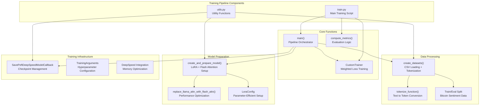
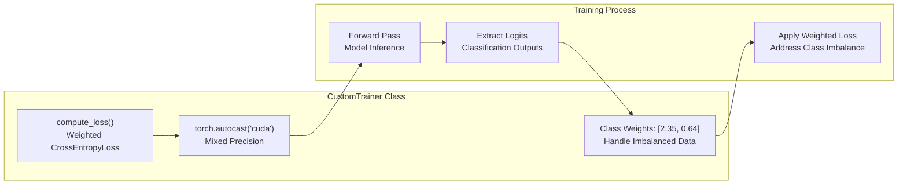
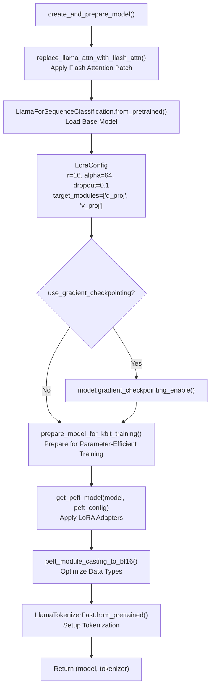
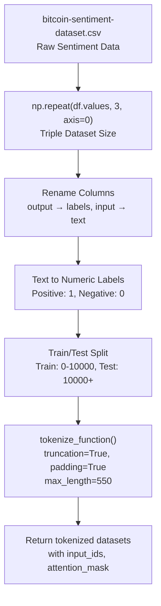
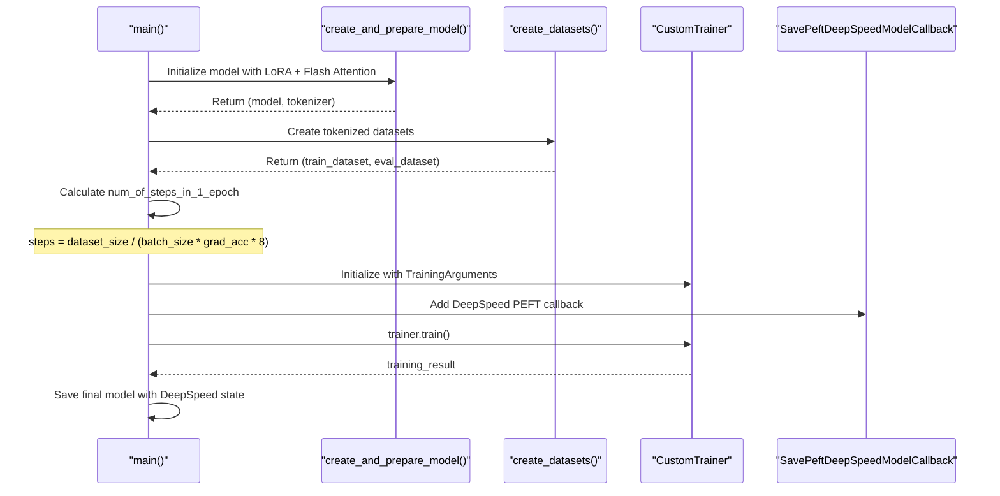
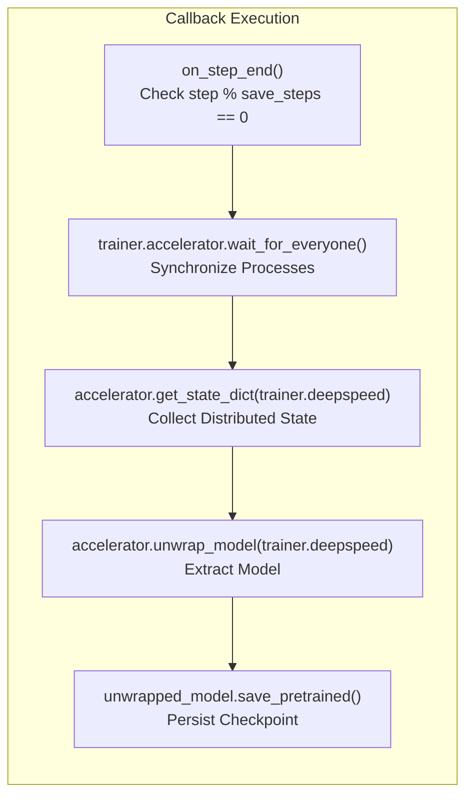

# Training Pipeline

<details>
<summary>Relevant source files</summary>

The following files were used as context for generating this wiki page:

- [optimal_llm_codebase/train.py](optimal_llm_codebase/train.py)
- [optimal_llm_codebase/utils.py](optimal_llm_codebase/utils.py)

</details>


## Purpose and Scope

The Training Pipeline implements the complete fine-tuning workflow for Llama2-7b models using parameter-efficient techniques. This document covers the main training script, utility functions, and the orchestration of model preparation, dataset creation, and training execution within the `optimal_llm_codebase` package.

For information about the runtime calculation that determines optimal parameters for this pipeline, see [Runtime Calculator Script](#2.1). For details about the DeepSpeed configuration used by this pipeline, see [DeepSpeed Configuration](#3.2).

## Pipeline Architecture Overview

The training pipeline consists of two primary components that work together to execute fine-tuning with memory and performance optimizations:



**Sources:** [optimal_llm_codebase/train.py:1-314](), [optimal_llm_codebase/utils.py:1-149]()

## Main Training Script Components

The `train.py` script serves as the entry point and orchestrator for the entire training process. It implements several key components:

### Command Line Interface

The script accepts comprehensive configuration through command line arguments covering model parameters, training hyperparameters, and infrastructure settings:

| Parameter Category | Key Arguments | Purpose |
|-------------------|---------------|---------|
| Model Configuration | `model_name`, `lora_r`, `lora_alpha`, `lora_dropout` | Define base model and LoRA settings |
| Training Batch Settings | `per_device_train_batch_size`, `gradient_accumulation_steps` | Control memory usage and effective batch size |
| Optimization | `optim`, `max_grad_norm`, `warmup_ratio`, `lr_scheduler_type` | Configure training dynamics |
| Infrastructure | `bf16`, `use_gradient_checkpointing`, `output_dir` | Enable performance optimizations |

**Sources:** [optimal_llm_codebase/train.py:182-309]()

### CustomTrainer Implementation

The pipeline implements a specialized trainer class that extends the base `Trainer` with custom loss computation:



The custom loss function addresses class imbalance in the sentiment dataset by applying weights of `[2.35, 0.64]` to the CrossEntropyLoss, emphasizing the minority class.

**Sources:** [optimal_llm_codebase/train.py:62-81]()

### Evaluation Metrics

The training pipeline implements precision-based evaluation through the `compute_metrics` function, which integrates with the HuggingFace `evaluate` library:

**Sources:** [optimal_llm_codebase/train.py:26-54]()

## Utility Functions and Model Preparation

The `utils.py` module provides critical infrastructure for model and dataset preparation:

### Model Creation and Optimization Pipeline



The model preparation process integrates multiple optimization techniques:
- **Flash Attention**: Applied via monkey patching for memory efficiency
- **LoRA (Low-Rank Adaptation)**: Parameter-efficient fine-tuning with rank 16
- **Gradient Checkpointing**: Memory optimization at the cost of computation
- **Mixed Precision**: BFloat16 casting for compatible modules

**Sources:** [optimal_llm_codebase/utils.py:91-135](), [optimal_llm_codebase/utils.py:138-149]()

### Dataset Creation and Processing

The dataset pipeline transforms raw CSV data into tokenized training and evaluation sets:



**Sources:** [optimal_llm_codebase/utils.py:59-88](), [optimal_llm_codebase/utils.py:52-56]()

## Training Execution Flow

The main training loop orchestrates the complete pipeline through several phases:

### Initialization and Setup



**Sources:** [optimal_llm_codebase/train.py:83-180]()

### Training Configuration

The pipeline calculates training steps dynamically based on dataset size and distributed training parameters:

```
num_of_steps_in_1_epoch = train_dataset.shape[0] / (
    per_device_train_batch_size * gradient_accumulation_steps * 8
)
```

Key training arguments include:
- **Mixed Precision**: BFloat16 enabled for performance
- **Gradient Checkpointing**: Memory optimization
- **Evaluation Strategy**: Step-based evaluation every 3 steps
- **Optimizer**: Adafactor for memory-efficient optimization

**Sources:** [optimal_llm_codebase/train.py:90-123]()

## Model Checkpointing and Persistence

The training pipeline implements sophisticated checkpointing through the `SavePeftDeepSpeedModelCallback` class:

### DeepSpeed-Compatible Checkpointing



The callback ensures proper state collection across distributed training processes and saves only on the main process to avoid conflicts.

**Sources:** [optimal_llm_codebase/utils.py:22-49]()

### Final Model Persistence

After training completion, the pipeline performs a final model save with complete state synchronization and exports training metrics to CSV format for analysis.

**Sources:** [optimal_llm_codebase/train.py:166-180]()
