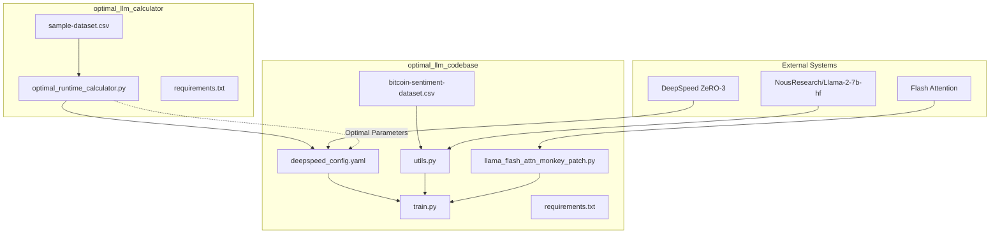
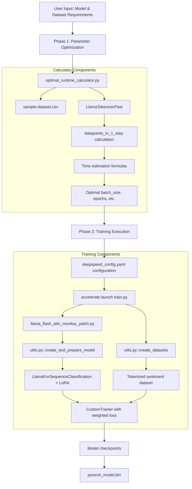
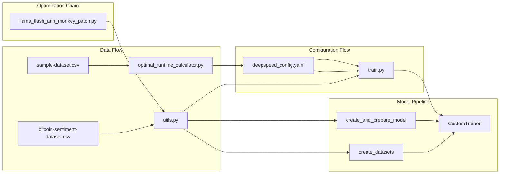

# Overview

Relevant source files

The following files were used as context for generating this wiki page:

- [README.md](README.md)

This document provides an overview of the LLM Calculator repository, a dual-purpose system designed for optimizing and executing fine-tuning workflows for Llama2-7b models. The repository contains two main packages: a runtime calculator for parameter optimization and a complete training pipeline with performance optimizations.

For detailed information about the runtime calculation functionality, see [LLM Runtime Calculator Package](#2). For information about the actual training implementation, see [LLM Training Codebase Package](#3).

## System Purpose

The LLM Calculator repository addresses two critical needs in LLM fine-tuning:

1. **Runtime Optimization**: Calculates optimal training parameters to minimize computational time and resources
2. **Efficient Training**: Provides a production-ready fine-tuning pipeline with advanced optimization techniques

The system is specifically designed for fine-tuning the `NousResearch/Llama-2-7b-hf` model using parameter-efficient techniques and memory optimization strategies.

## Architecture Overview

The following diagram shows the high-level architecture of the LLM Calculator system:

### System Architecture

*Sources: README.md, system architecture analysis*

## Two-Phase Workflow

The system implements a two-phase approach to LLM fine-tuning optimization:

### Complete Workflow Process

*Sources: System workflow analysis, optimal_runtime_calculator.py, train.py, utils.py*

## Key Components

The repository is organized into several key components that work together to provide the complete optimization and training pipeline:

| Component | Purpose | Key Files |
|-----------|---------|-----------|
| **Runtime Calculator** | Parameter optimization and time estimation | `optimal_runtime_calculator.py`, `sample-dataset.csv` |
| **Training Pipeline** | Core fine-tuning logic with custom trainer | `train.py`, `utils.py` |
| **Performance Optimization** | Memory and speed enhancements | `deepspeed_config.yaml`, `llama_flash_attn_monkey_patch.py` |
| **Training Data** | Sentiment classification dataset | `bitcoin-sentiment-dataset.csv` |

### Component Relationships

*Sources: File structure analysis, component dependency mapping*

## Performance Optimizations

The system incorporates multiple optimization techniques to handle large model fine-tuning efficiently:

- **DeepSpeed ZeRO Stage 3**: Memory partitioning across GPUs for large model support
- **Flash Attention**: Optimized attention mechanism for compatible hardware
- **LoRA (Low-Rank Adaptation)**: Parameter-efficient fine-tuning approach
- **8-bit Quantization**: Memory reduction through model quantization
- **Gradient Checkpointing**: Trade compute for memory during backpropagation

For specific implementation details of the runtime calculator, see [Runtime Calculator Script](#2.1). For training pipeline specifics, see [Training Pipeline](#3.1). For performance optimization configurations, see [DeepSpeed Configuration](#3.2) and [Flash Attention Optimization](#3.3).

*Sources: README.md, system architecture analysis*
